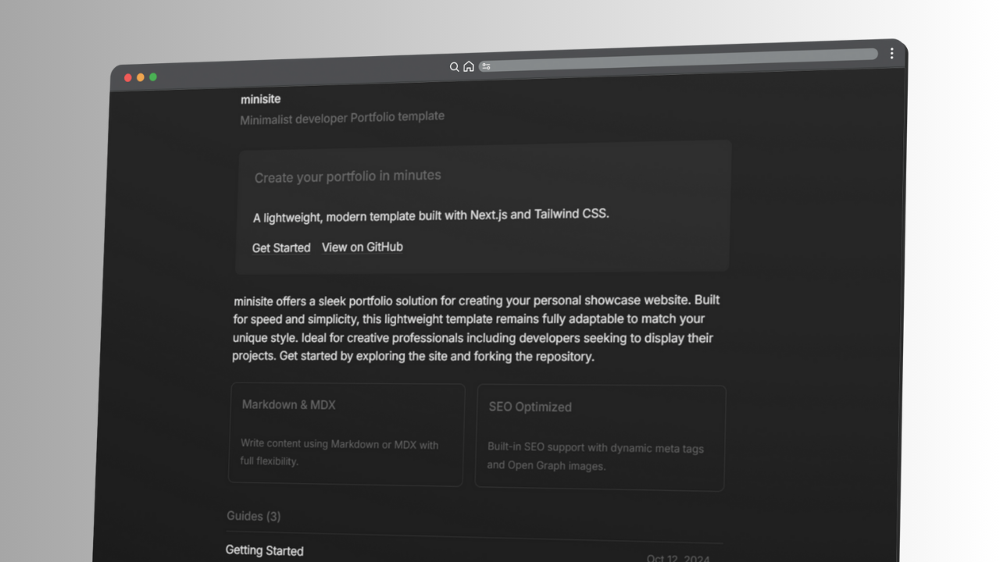

Minisite offers a sleek portfolio solution for creating your personal showcase website. Built for speed and simplicity, this lightweight template remains fully adaptable to match your unique style. Ideal for creative professionals including developers seeking to display their projects. Get started by exploring the site and forking the repository.

## Features

- Fully responsive and mobile-friendly design for all devices
- Write content effortlessly with Markdown and MDX support
- Advanced SEO: automatic sitemaps, robots.txt, and rich metadata
- Dynamic Open Graph images for beautiful social sharing
- Instant code highlighting for developers and technical writers
- Powered by Tailwind CSS v4 for rapid, modern styling
- Automatic post timestamps for easy content management
- Flexible frontmatter for rich post customization
- Intuitive, clean codebase for fast customization and scaling
- Seamless light/dark mode toggle for user comfort
- Built for easy expansion and theming to match your brand
- Minimalist, elegant UI focused on content and usability

## Documentation

To get started with minisite, check out the [Guides](https://minisite-psi.vercel.app/guides).

